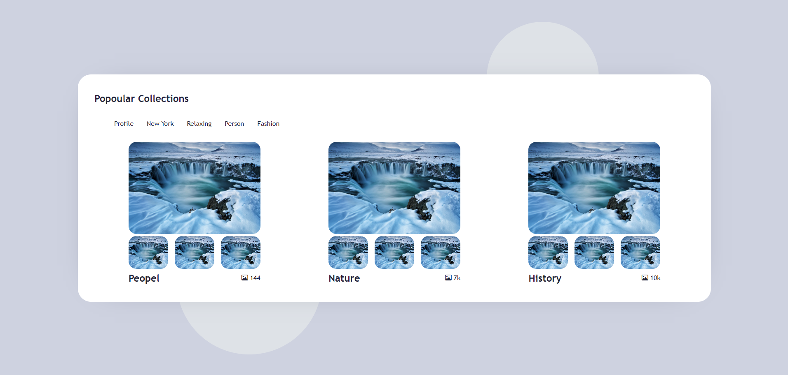
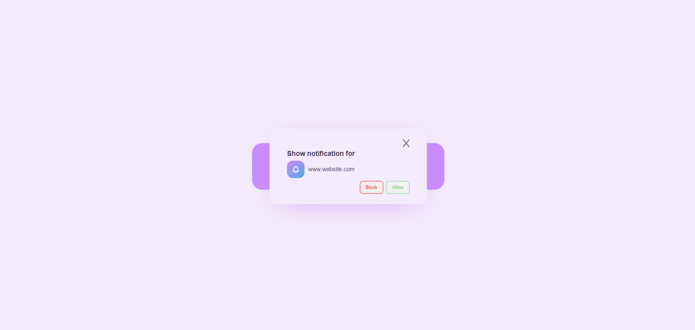
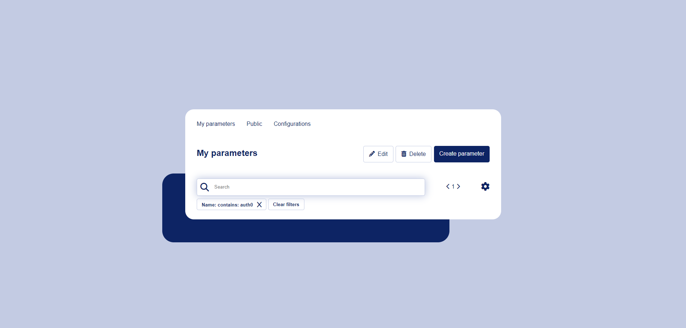
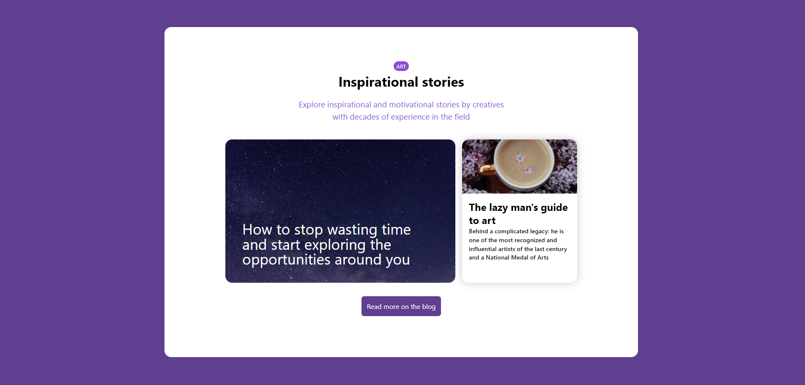
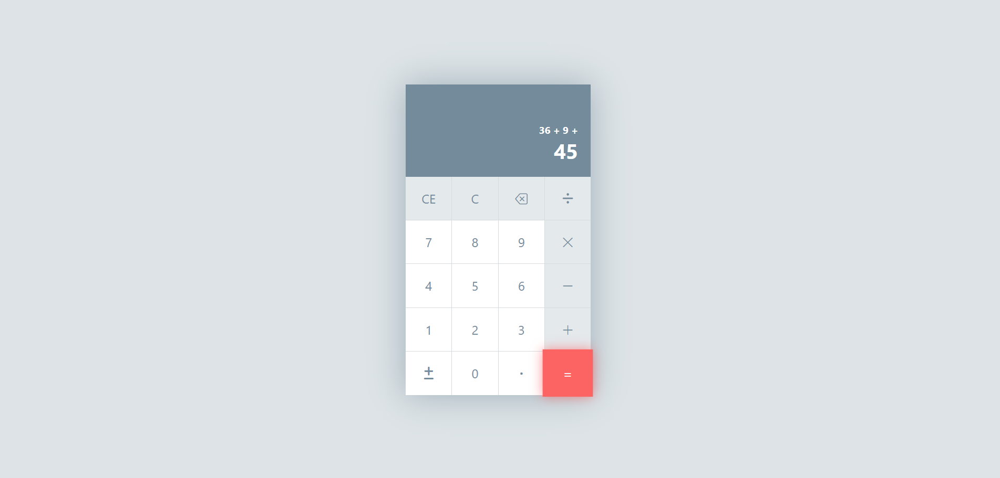

# CSS-Exercise
🚀 CSS Front-end Exercise Repository 🌟

## Resources 📚

- [UI Design Daily](https://uidesigndaily.com/)
  
## Features:

✅ Practical tasks and exercises.

🚀 Performance-focused solutions.

📝 Step-by-step guidance.

🔍 Code optimization tips.

💡 Multiple perspectives.

Happy coding! If you have any questions or need assistance, feel free to open an issue or reach out. 🤝
 
 
 
 
 

 
 
  
